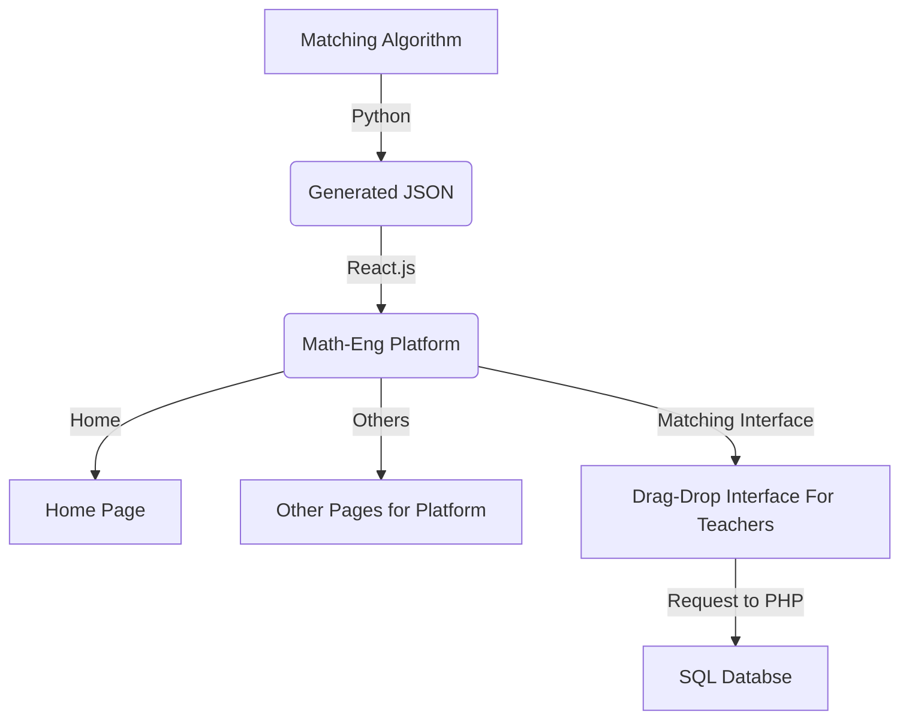

---
# try also 'default' to start simple
theme: seriph
# random image from a curated Unsplash collection by Anthony
# like them? see https://unsplash.com/collections/94734566/slidev
background: https://source.unsplash.com/collection/94734566/1920x1080
# apply any windi css classes to the current slide
class: 'text-center'
# https://sli.dev/custom/highlighters.html
highlighter: shiki
# show line numbers in code blocks
lineNumbers: false
# some information about the slides, markdown enabled
info: |
  ## Slidev Starter Template
  Presentation slides for developers.

  Learn more at [Sli.dev](https://sli.dev)
# persist drawings in exports and build
drawings:
  persist: false
# use UnoCSS
css: unocss
---

# Graduation Project

Presentation slides for graduation student-teacher matching system.

<div class="pt-12">
  <span @click="$slidev.nav.next" class="px-2 py-1 rounded cursor-pointer" hover="bg-white bg-opacity-10">
    Press Space for next page <carbon:arrow-right class="inline"/>
  </span>
</div>

<div class="abs-br m-6 flex gap-2">
  <button @click="$slidev.nav.openInEditor()" title="Open in Editor" class="text-xl icon-btn opacity-50 !border-none !hover:text-white">
    <carbon:edit />
  </button>
  <a href="https://github.com/BerkkanB/Graduation-Project" target="_blank" alt="GitHub"
    class="text-xl icon-btn opacity-50 !border-none !hover:text-white">
    <carbon-logo-github />
  </a>
</div>

<!--
The last comment block of each slide will be treated as slide notes. It will be visible and editable in Presenter Mode along with the slide. [Read more in the docs](https://sli.dev/guide/syntax.html#notes)
-->

---

# Why we need that project ?

There were some difficulties especially for teachers. 

- 📝 **Matching-Algorithm** - There are teachers' preferences and students' preferences. We need to match them as good as possible.
- 🎨 **Customize the Matching** - After matching, we need to customize the matching. For example, we can change the matching by changing the preferences of teachers or students.
- 🧑‍💻 **Save Results for Public Information** - We need to save the results for public information. For example, we can show the results to students and teachers.


<br>
<br>


---

# Diagrams

Project Diagram

<div class="grid grid-cols-3 gap-10 pt-4 -mb-6">





</div>

[Learn More](https://sli.dev/guide/syntax.html#diagrams)

---

# Base Page 

We have a page which could be used for Mathematical Engineering Department stuffs
### Sample Design


---
layout: image-right
image: https://source.unsplash.com/collection/94734566/1920x1080
---

# Navigation

There is navigation structure for our project.

```html {all|2,8|3-7|all}
<HashRouter>
      <Routes>
        <Route path="/" element={<UnderConstruction />} />
        <Route path="/dashboard" element={<UnderConstruction />} />
        <Route path="/graduation" element={<GraduationPage />} />
        <Route path="/exams" element={<UnderConstruction />} />
        <Route path="/teachers" element={<UnderConstruction />} />
      </Routes>
    </HashRouter>

```

<arrow v-click="3" x1="200" y1="420" x2="330" y2="300" color="#564" width="3" arrowSize="1" />


---

# Get Input


```ts {all|1,21|2|4-7|8|11-18|20|all}
function createData(input) {
  let outSourceData = JSON.parse(input)
  console.log("outSourceData: ", outSourceData)
  let teachers = []
  teachers = outSourceData.map((item) => {
    return item.teacher_name
  })
  teachers = [...new Set(teachers)]
  let usefulData = []
  let temp = []
  teachers.forEach((teacher) => {
    temp = []
    outSourceData.forEach((item) => {
      if (item.teacher_name === teacher) {
        temp.push({ name: item.student_name, id: uuid() })
      }
    })
    usefulData.push(temp)
  })
  return { usefulData, teachers }
}

```

---

# Get Output


```ts {1,12|3-10|all}
function giveOutputData(state, teachers) {
    let output = [];
    state.forEach((el, ind) => {
        el.forEach((item) => {
            output.push({
                name: item.name,
                teacher: teachers[ind]
            });
        });
    });
    return output;
}

```

---
# Lets see how it works

<div>
  <a href="https://github.com/BerkkanB/Graduation-Project" target="_blank" alt="GitHub"
    class="text-xl icon-btn opacity-50 !border-none !hover:text-white">
    <carbon-logo-github />
  </a>
  <a href="https://web.itu.edu.tr/butun18/#/" target="_blank" alt="itu.edu.tr"
    class="text-xl icon-btn opacity-50 !border-none !hover:text-white">
    <carbon-home />
  </a>
</div>
